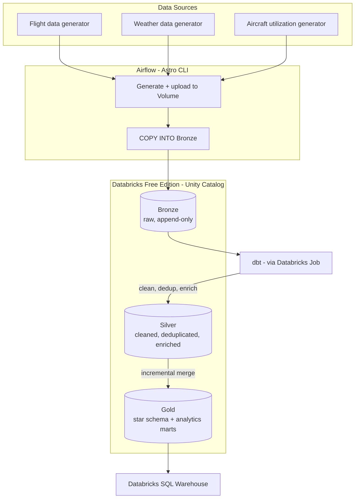
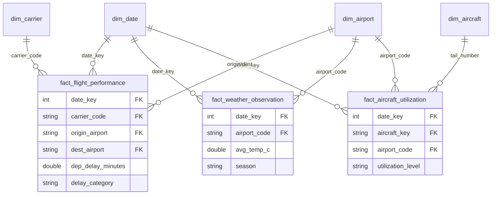

# airline-cloud-warehouse

A cloud data lakehouse built on Databricks Free Edition, orchestrated with Airflow and transformed with dbt. Demonstrates a full batch ELT pipeline following the medallion architecture (Bronze/Silver/Gold), with a dimensional model (star schema) serving three fact tables and four shared dimensions.

Built as a hands-on learning project to practice modern data engineering patterns end-to-end: ingestion, transformation, testing, orchestration, and CI/CD.

## Architecture



The Airflow DAG runs daily on a schedule: it generates fresh source data, uploads it to a Databricks Volume, loads it into Bronze via `COPY INTO`, then triggers a full `dbt build` as a Databricks Job task.

## Data model

Three fact tables share four conformed dimensions, at different grains:



`dim_airport` plays a dual role in `fact_flight_performance` (origin and destination), and is shared across all three facts. An additional analytics mart, `mart_daily_airport_conditions`, aggregates all three facts to a common (date, airport) grain to support cross-domain analysis (e.g. weather vs. delays).

## Tech stack

| Layer | Technology |
|---|---|
| Lakehouse / compute | Databricks Free Edition, Unity Catalog, Delta Lake |
| Transformation | dbt-core + dbt-databricks |
| Orchestration | Apache Airflow (Astro CLI, Docker) |
| CI/CD | GitHub Actions (dbt build validation, Airflow DAG import validation) |
| Data quality | dbt tests (uniqueness, referential integrity, accepted values) |
| Language | Python (ingestion), SQL (transformation) |

## Repository structure
```
airline-cloud-warehouse/
├── airflow/                    # Astro CLI project
│   └── dags/
│       └── extraction_and_dbt_dag.py
├── ingestion/                  # Data generation scripts
│   ├── generate_random_flights.py
│   ├── generate_weather_data.py
│   ├── generate_aircraft_utilization.py
│   └── reference_data.py       # shared airport reference (single source of truth)
├── dbt_project/airline_warehouse/
│   ├── models/
│   │   ├── staging/             # Bronze -> Silver: clean, dedupe, enrich
│   │   └── marts/
│   │       ├── *.sql            # dimensions and facts (Gold)
│   │       └── analytics/       # cross-fact aggregates
│   └── seeds/                   # static reference data (airports, carriers, aircraft)
├── .github/workflows/
│   ├── dbt_ci.yml                # validates dbt build on PR
│   └── airflow_ci.yml            # validates DAG imports on PR
├── sql/bronze_ddl/               # Bronze table DDL (manually applied, documentation + DR)
```

## Key design decisions

- **Bronze stays append-only.** Deduplication and enrichment happen in Silver (via `ROW_NUMBER()` on the business key), not by mutating raw data — keeping Bronze as a faithful record of what was actually ingested.
- **Gold facts are `incremental` with `merge` strategy.** Prevents duplicate rows on DAG re-runs while avoiding full table rebuilds on every batch.
- **Shared dimensions across facts**, including a role-playing dimension (`dim_airport` as both origin and destination) — the model is designed to demonstrate dimensional modeling principles, not just move data.
- **Custom `generate_schema_name` macro** enforces Bronze/Silver/Gold as literal schema names, independent of the dbt target schema.

## Running locally

```bash
# dbt
cd dbt_project/airline_warehouse
dbt deps
dbt build

# Airflow
cd airflow
astro dev start
```

Requires a `.env` file (not committed) with `DATABRICKS_HOST`, `DATABRICKS_HTTP_PATH`, and `DATABRICKS_TOKEN`.

## CI/CD

- Every PR touching `dbt_project/**` runs `dbt build` against Databricks via GitHub Actions.
- Every PR touching `airflow/**` validates that all DAGs import without errors, using Airflow's `DagBag`.
- `master` is protected: changes only land via reviewed, passing PRs.

## BI Dashboard

A Databricks SQL Dashboard ("Airline Operations Overview") visualizes key metrics from the Gold layer — departure delay trends, flight volume by airport, weather impact on delays, and overall on-time performance.

## Documentation

Full dbt documentation (models, lineage graph, tests) is available at:
[https://mateuszjanuszitconsultion.github.io/airline-cloud-warehouse/](https://mateuszjanuszitconsultion.github.io/airline-cloud-warehouse/)

## Contributing

See [CONTRIBUTING.md](CONTRIBUTING.md) for commit message conventions and branch naming.

## License

MIT — see [LICENSE](LICENSE) for details.