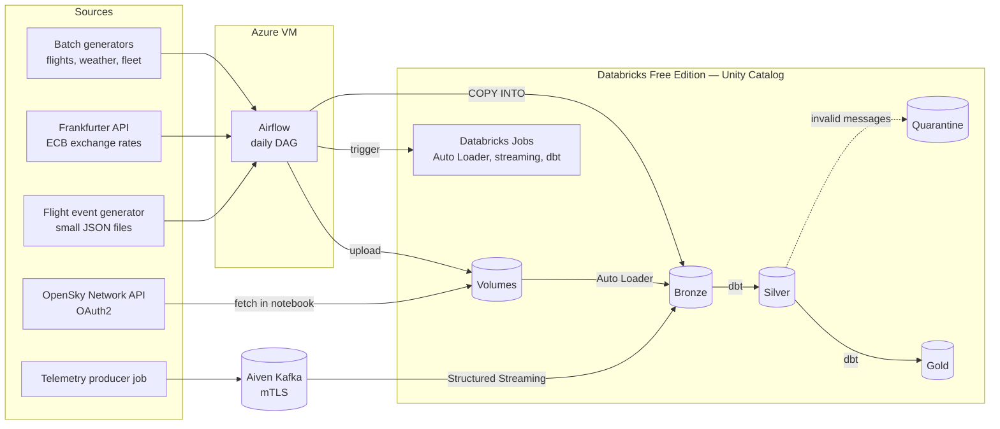
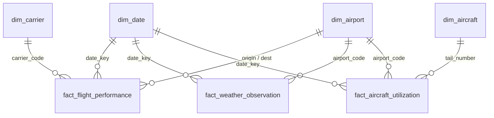

# Architecture

This document describes how the system is built and how data flows through it. The reasoning behind each major choice is recorded in [decision records](decisions/); incidents and what they taught are in [lessons learned](lessons-learned.md); running, monitoring, freezing and restoring the system is covered in [operations](operations.md).

## System overview

## Ingestion paths

Data enters Bronze through four mechanisms, chosen per source rather than forced into one pattern:

| Source | Mechanism | Bronze table | Trigger |
|---|---|---|---|
| Flights, weather, fleet utilization (generators) | Validated with Great Expectations, written to Parquet, uploaded to a Volume, loaded with `COPY INTO` | `flights_raw`, `weather_raw`, `aircraft_utilization_raw` | Airflow, daily |
| Exchange rates (Frankfurter API) | Fetched in Python, uploaded to a Volume, `COPY INTO` | `currency_rates_raw` | Airflow, daily |
| Flight lifecycle events (generator) | Many small JSON files in a Volume, Auto Loader with `availableNow` | `flight_events_raw` | Databricks job triggered by Airflow |
| Aircraft state vectors (OpenSky API) | Fetched inside a Databricks notebook with credentials from Secret Scopes, then Auto Loader | `opensky_states_raw` | Databricks job, own schedule |
| Aircraft telemetry | Python producer → Aiven Kafka → Spark Structured Streaming (`availableNow`) | `aircraft_telemetry_raw` | Two Databricks jobs with independent schedules |

Every Bronze table carries `_ingested_at` and `_source_file` (or Kafka topic, partition and offset), so any row can be traced back to its load.

## Layers

### Bronze — raw, append-only
Data as received. Never updated or deduplicated in place. DDL is kept in `sql/bronze_ddl/`; tables are clustered on their primary date or time column.

### Silver — cleaned and deduplicated (dbt)
One staging model per source: `stg_flights`, `stg_weather`, `stg_aircraft_utilization`, `stg_currency_rates`, `stg_flight_events`, `stg_opensky_states`, `stg_aircraft_telemetry`.

- Deduplication with `ROW_NUMBER()` over the business key, keeping the latest load. The key reflects what a row means: one flight per business key; every event for event data; every snapshot per aircraft for OpenSky trajectories; Kafka coordinates `(topic, partition, offset)` for telemetry.
- Kafka telemetry is parsed in an ephemeral model (`stg_aircraft_telemetry_parsed`) that holds JSON parsing and validation once. Valid records go to `stg_aircraft_telemetry`; invalid ones go to `stg_aircraft_telemetry_quarantine` with a reason: `malformed_json`, `schema_mismatch` or `key_mismatch`.

### Gold — dimensional model (dbt)

| Model | Type | Notes |
|---|---|---|
| `fact_flight_performance` | Transaction fact, incremental `merge` | One row per flight; delays and cancellations |
| `fact_weather_observation` | Transaction fact, incremental `merge` | One row per airport per day |
| `fact_aircraft_utilization` | Transaction fact, incremental `merge` | One row per aircraft per day |
| `fact_flight_lifecycle` | Accumulating snapshot | One row per flight, milestone timestamps filled in as events arrive |
| `dim_date`, `dim_airport`, `dim_carrier`, `dim_aircraft` | Conformed dimensions | `dim_airport` is role-playing (origin and destination) |
| `dim_aircraft_scd2` | SCD Type 2 | From `aircraft_snapshot` |
| `dim_currency_scd2` | SCD Type 2 | From `currency_snapshot`; real ECB rates |
| `dim_route` | Derived dimension | Directional origin–destination pairs observed in flight data |
| `mart_daily_airport_conditions` | Analytics mart | All three transaction facts at a shared (date, airport) grain |

`fact_flight_lifecycle`, `dim_route` and `dim_currency_scd2` are not yet connected to other models by relationship tests; they are modelled and tested on their own.

## Data quality

Quality is checked at three points, each catching a different class of problem:

| Where | Tool | Catches |
|---|---|---|
| Before data is written | Great Expectations in the generators | Bad data at the source |
| After transformation | dbt data tests, a dbt unit test, a custom audit test between layers, a singular completeness test for Kafka | Broken keys, lost rows between layers, logic errors at boundary values |
| Ingestion code | pytest | Business logic of the generators and reference data contracts |

Reference lists used by the generators (airports, carriers, aircraft) are read from the dbt seeds — one source of truth for both code and models.

## Orchestration

- **Airflow** (on an Azure VM) runs one daily DAG: parallel branches generate and upload each batch source, load it into Bronze, then trigger `dbt build` as a Databricks job task running from the Git repository. One active run at a time.
- **Databricks jobs** run independently of Airflow: OpenSky ingestion, the Kafka producer and consumer, and the data freshness check. They are defined as Databricks Asset Bundles and run code from the repository.

Producer and consumer are deliberately not chained: Kafka decouples them, and the consumer reads whatever has arrived since its last checkpoint ([ADR 0007](decisions/0007-kafka-on-aiven-and-decoupled-jobs.md)).

## Infrastructure and delivery

| Concern | How |
|---|---|
| Azure infrastructure (network, VM, Automation, budget) | Terraform modules, `prod` and `dev` environments, remote state in Azure Storage |
| Databricks platform (catalog, schemas, volumes, grants, secret scopes) | Terraform |
| Databricks jobs | Asset Bundles |
| Ownership between the two | One owner per object ([ADR 0001](decisions/0001-platform-and-jobs-ownership.md)) |
| CI | GitHub Actions: dbt build, Airflow DAG import tests, ingestion tests, Terraform plan with OIDC on pull requests |
| Delivery to the VM | Self-hosted runner on push to `master` ([ADR 0005](decisions/0005-self-hosted-runner-for-deployment.md)) |
| Python environments | uv with a lock file; one Python version per runtime ([ADR 0009](decisions/0009-python-environments-and-versions.md)) |

## Monitoring

Failures of jobs and tasks, hung jobs, and stale data each raise an email alert. Data freshness runs on Databricks rather than in Airflow, so it still alerts if the Airflow VM is down. Details in [ADR 0008](decisions/0008-monitoring-strategy.md) and [operations](operations.md).