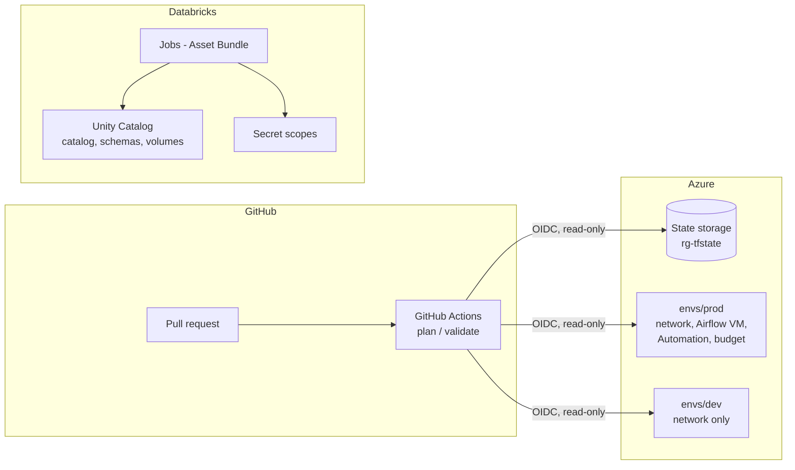

# Infrastructure as Code

All infrastructure of this project is managed as code: Azure resources and the
Databricks platform layer with Terraform, Databricks jobs with Databricks Asset
Bundles. Existing, manually created infrastructure was imported without downtime.

## Ownership

| Layer | Owner | Location |
|---|---|---|
| Azure: resource groups, network, VM, Automation, budget | Terraform | `infra/terraform/envs/` |
| Terraform state backend, CI identity | Terraform (bootstrap, applied locally) | `infra/terraform/bootstrap/` |
| Databricks: catalog, schemas, volumes, grants, secret scopes | Terraform | `infra/terraform/databricks/` |
| Databricks jobs and their workspace code | Asset Bundle | `databricks_jobs/` |
| Tables and data | dbt and ingestion pipelines | `dbt_project/`, `ingestion/`, ... |

Every object has exactly one owner in code. See [ADR 0001](../docs/adr/0001-platform-and-jobs-ownership.md).

## Architecture



## Layout and state

| Root module | Purpose | State key |
|---|---|---|
| `terraform/bootstrap` | state storage, CI identity | `bootstrap.terraform.tfstate` |
| `terraform/envs/prod` | production Azure resources | `prod.terraform.tfstate` |
| `terraform/envs/dev` | low-cost dev environment (no VM) | `dev.terraform.tfstate` |
| `terraform/databricks` | Databricks platform layer | `databricks.terraform.tfstate` |
| `terraform/modules/*` | shared modules: `network`, `airflow_vm`, `vm_scheduler`, `budget` | n/a |
| `terraform/databricks-pilot` | documented Free Edition capability pilot | n/a |

State lives in Azure Storage with Entra ID auth (no access keys), blob
versioning, soft delete, a lifecycle policy and a `CanNotDelete` lock.

## Running locally

Prerequisites: Terraform `~> 1.16`, Azure CLI (`az login`), Databricks CLI
profile, `ARM_SUBSCRIPTION_ID` set. Secret values go to `terraform.tfvars`
(git-ignored); see `terraform.tfvars.example` in each root module.

```bash
cd infra/terraform/envs/prod
terraform init -backend-config=backend.hcl
terraform plan -out=tfplan
terraform apply tfplan
```

Deploy order on a fresh environment: `bootstrap` → `envs/*` → `databricks` →
`databricks_jobs` (`databricks bundle deploy`). Jobs depend on volumes and
secret scopes managed by Terraform.

## CI

- `terraform-plan`: on pull requests, plans `envs/prod` and `envs/dev` with a
  read-only identity via OIDC (`-lock=false`) and comments the plan on the PR.
- `databricks-validate`: static checks without credentials (terraform validate
  without backend, bundle JSON schema).
- Apply and bundle deploy run locally. See [ADR 0002](../docs/adr/0002-infrastructure-ci-and-deployment.md).

## Known limitations

- Databricks Free Edition: catalogs cannot be created via API (created in UI,
  imported, `storage_root` ignored).
- Automation schedules are disabled in Azure; the provider cannot represent
  that state (guarded by `prevent_destroy`).
- Management lock changes need Owner rights and are applied locally.
- Bundle `root_path` and alert recipients resolve to the deploying identity.